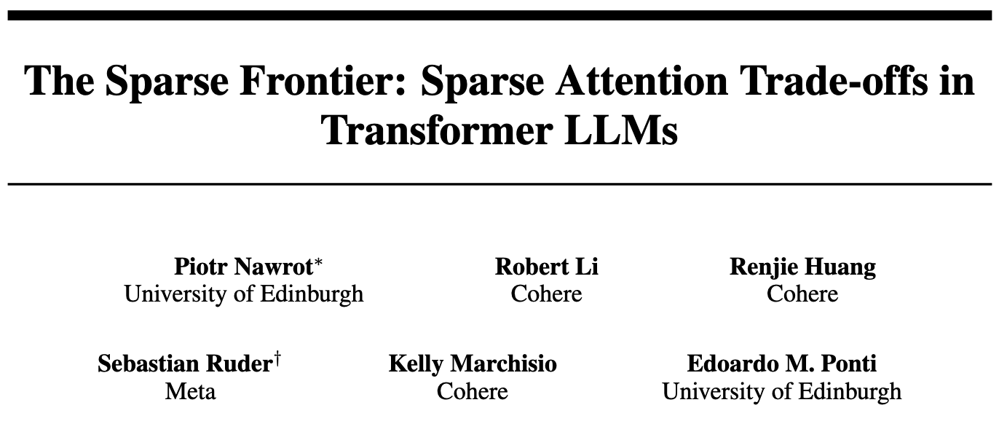

<p align="center">
  
</p>

## TL;DR

This repository contains the official implementation for the paper "[The Sparse Frontier: Sparse Attention Trade-offs in Transformer LLMs](https://arxiv.org/abs/2504.17768)". We perform a large-scale empirical evaluation of *training-free* sparse attention methods in LLMs (7B to 72B parameters) on long sequences (16K to 128K tokens) across diverse tasks.

**Key Findings:**
1.  **IsoFLOPS:** For very long sequences, larger, highly sparse models are preferable to smaller, dense ones under a fixed compute budget.
2.  **Sparsity Limits:** Higher sparsity can be tolerated during decoding than prefilling while preserving accuracy (correlating with model size), but even moderate sparsity often degrades performance on at least one task.
3.  **No Universal Best:** The optimal sparse attention strategy depends on the task and inference phase; no single method excels everywhere.
4.  **Scaling Laws:** We introduce and validate scaling laws specific to sparse attention, suggesting our findings generalize.

**Conclusion:** Sparse attention is a key tool for long-context LLMs but requires careful evaluation of accuracy-efficiency trade-offs for specific applications. This codebase enables reproducing our experiments and further research.

## Setup

Follow these steps to set up the environment and prepare for running experiments:

1.  **Create Virtual Environment and Install Dependencies:**
    Set up a dedicated Python environment and install the required packages, including compiling custom CUDA kernels.

    ```bash
    # Create a virtual environment using Python 3.11
    python3.11 -m venv .venv

    # Activate the virtual environment
    source .venv/bin/activate

    # Upgrade pip and install essential build/utility tools
    pip install --no-cache-dir --upgrade pip setuptools wheel psutil ninja

    # Install PyTorch
    pip install --no-cache-dir torch==2.5.1

    # Install the sparse_frontier project in editable mode
    pip install --no-cache-dir -e .

    # Compile custom CUDA kernels (for MInference attention)
    # Adjust MAX_JOBS based on your system core count for faster compilation
    MAX_JOBS=8 python compile.py build_ext --inplace --build-lib ./sparse_frontier/modelling/attention/minference
    ```

2.  **Configure Paths:**
    Modify the default configuration file to specify where data, results, and checkpoints should be stored on your system.

    *   Edit the `paths` section in `configs/default.yaml`.

3.  **Download Model Checkpoints:**
    Obtain the pre-trained model weights you intend to evaluate from Hugging Face Hub. 
    
    *   Ensure the final directory structure for the downloaded checkpoints matches the format expected by the corresponding model configuration file (e.g., as defined in `configs/model/qwen_7b.yaml`). The `model.path` variable in these configs should point to the directory containing the model files.

## Where should I look at if I want to:

### Reproduce your experiments

Experiments are launched using the main script `sparse_frontier.main`. Configuration is managed via [Hydra](https://hydra.cc/), allowing parameters to be set in YAML files (primarily `configs/default.yaml`) and overridden directly from the command line.

The execution pipeline typically involves three stages, controlled by the `mode` parameter (defaulting to `all`):
1.  **Preparation (`preparation.py`):** Generates and saves task-specific data based on the selected `task` configuration. Tasks are defined in `sparse_frontier/tasks/` (inheriting from `AbstractTask` and `AbstractSample`) and registered in `sparse_frontier/tasks/registry.py`.
2.  **Prediction (`prediction.py`):** Runs the specified `model` with the chosen `attention` mechanism on the prepared data, saving the model outputs. Attention mechanisms are defined in `sparse_frontier/modelling/attention/` and registered in `sparse_frontier/modelling/attention/registry.py`.
3.  **Evaluation (`evaluation.py`):** Compares the predictions against the gold answers using the task's specific evaluation logic and saves the final metrics.

For example, to run the `ruler_niah` task using the `llama_8b` model configuration with standard `dense` attention on 4 samples using 2 GPUs:

```bash
python -m sparse_frontier.main task=ruler_niah model=llama_8b attention=dense samples=4 gpus=2
```

### Understand how you modified vLLM to test my own Sparse Attention

We integrate custom sparse attention mechanisms by intercepting and modifying vLLM's standard attention execution flow. Here's a breakdown of the key components involved:

1.  **Patching vLLM's Attention:** We replace vLLM's default `FlashAttentionImpl.forward` method with our custom function, `vllm_patched_forward` (defined in `sparse_frontier/modelling/models/vllm_model.py`). This function serves as the entry point for our custom attention logic within the vLLM generation loop.

2.  **Centralized Handling:** The `vllm_patched_forward` function delegates the core processing to an `AttentionHandler` instance (from `sparse_frontier/modelling/attention/handler.py`). This handler manages layer-specific state (like token counts per head) and differentiates between the prefill and decoding phases of generation.

3.  **Abstract Attention Interface:** The actual attention computation logic for different patterns is encapsulated in classes that inherit from `AbstractAttention` (defined in `sparse_frontier/modelling/attention/abstract_attention.py`). The `AttentionHandler` retrieves the currently configured attention implementation using `get_attention()` (from `sparse_frontier/modelling/attention/registry.py`).

4.  **Implementing a Custom Pattern:** To introduce a new sparse attention mechanism:
    *   Create a new class inheriting from `AbstractAttention`.
    *   Implement the necessary methods based on your pattern's requirements:
        *   `__call__(self, queries, keys, values, layer_idx)`: Implement the attention computation logic for the prefill phase. The default implementation uses standard FlashAttention.
        *   `decode(self, query, keys, values, k_cache, v_cache, cache_seqlens, output, layer_idx)`: Implement the attention computation for the single-token decoding phase, typically involving interaction with the KV cache. The default uses `flash_attn_with_kvcache`. Specific methods like Quest (`efficient_decoding.py`) implement custom logic (e.g., page selection).
        *   `kv_compress(self, queries, keys, values)`: (Optional) Implement logic to compress or select keys and values *after* the prefill computation, before they are written to the KV cache by `update_kv_cache` in `handler.py`. See `SnapKVCompression` (`kv_compression.py`) for an example. It should return the processed keys, values, and the resulting sequence lengths per head.

5.  **Registration:** Add your new class to the `ATTENTION_REGISTRY` in `sparse_frontier/modelling/attention/registry.py`. This allows selecting your custom attention mechanism through the experiment configuration files.

### Understand or Create Experimental Datasets

Experimental data generation is handled by task-specific modules located in `sparse_frontier/tasks/`. Each task implements `AbstractTask` and `AbstractSample` subclasses (defined in `sparse_frontier/tasks/abstract_*.py`) to define data loading, preprocessing, and the formatting of individual input prompts. Tasks are registered in `sparse_frontier/tasks/registry.py` and selected via configuration (e.g., `task=your_task_name`). The `preparation.py` script orchestrates the generation process based on the configuration, saving the formatted samples. See existing tasks like `QATask` (`qa_task.py`) or the Story task (`narrative.py`, `templates.py`) for implementation examples.

## References

### Sparse Attention Patterns

In this repository, we evaluate 6 sparse attention patterns:

| Pattern | Source |
|---------|--------|
| **Vertical-Slash / Block-Sparse** | [Microsoft](https://github.com/microsoft/MInference) |
| **FlexPrefill** | [ByteDance-Seed](https://github.com/ByteDance-Seed/FlexPrefill) |
| **SnapKV** | [FasterDecoding](https://github.com/FasterDecoding/SnapKV) |
| **Ada-SnapKV** | [FFY0](https://github.com/FFY0/AdaKV) |
| **Quest** | [MIT-HAN-Lab](https://github.com/mit-han-lab/Quest) |

We either re-implement these patterns based on the original code or borrow implementations including kernels (for Vertical-Slash and Block-Sparse) from MInference.

### Evaluation Tasks

Our evaluation framework includes the following tasks:

1. **RULER Tasks**: Re-implementation of NIAH, VT, and CWE tasks from [NVIDIA/RULER](https://github.com/NVIDIA/RULER)

2. **QA Tasks**:
   - Toefl and Quality datasets from [LC-VS-RAG](https://github.com/lixinze777/LC_VS_RAG)
   - Squad dataset from [NVIDIA/RULER](https://github.com/NVIDIA/RULER)

3. **Novel Story Tasks**: Narrative tasks developed specifically for this project.

## Cite

If you found the repository useful consider citing the paper about this work.

```
@article{nawrot2025sparsefrontier,
      title={The Sparse Frontier: Sparse Attention Trade-offs in Transformer LLMs}, 
      author={Piotr Nawrot and Robert Li and Renjie Huang and Sebastian Ruder and Kelly Marchisio and Edoardo M. Ponti},
      year={2025},
      journal={arXiv:2504.17768}
      url={https://arxiv.org/abs/2504.17768}, 
}
```

## Issues:

If you have any questions, feel free to raise a Github issue or contact me directly at: piotr.nawrot@ed.ac.uk
